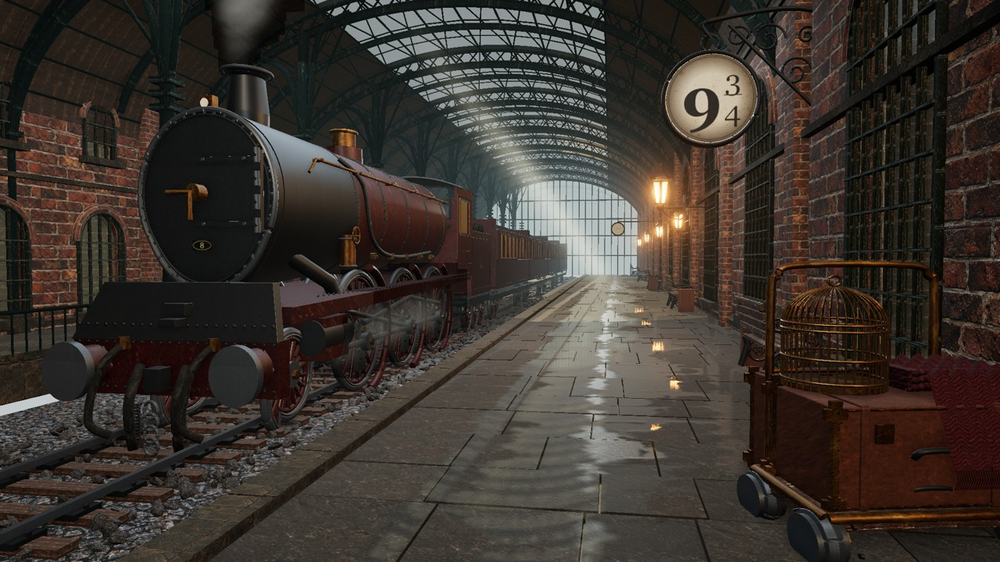

# Platform Nine

A real-time Three.js reconstruction of a Victorian steam railway platform.
The locked visual requirements are in [`goal.md`](goal.md).

## Progress

**Status: runnable and deployed; visual acceptance is not complete.** The Three.js scene includes seven
custom Blender-authored GLB assets, thirteen material sets, modular station
architecture, lighting, animated steam, and optional exploration.
The independent Dream Loop judgments are **4.0/10**, **4.5/10**, **5.1/10**, then **5.7/10**; visual acceptance
requires at least **8.0/10** plus acceptable measured performance.
The architectural rethink now has deep-section girders, connected roof columns,
recessed window rooms, multilevel facades, laid slabs, diffuse puddle boundaries,
and collision-bounded platform walking. The latest judgment still calls for
better material response, wetness, lighting, and locomotive/prop detail.
This is a work-in-progress reconstruction, not a completed match.

GitHub Pages is configured at **https://ridermw.github.io/platform-nine-1/**.
Pushes to `main` run the build and asset checks, then deploy the static site.



A materially different TRELLIS locomotive candidate scored **5.2/10** and was
rejected; the authored locomotive remains in the runtime. Subsequent trolley
and bench reconstruction requests were rejected by the provider's anonymous
GPU quota. The candidate and verdicts remain local in `.dream-loop/`.

The 4K manifest also links to an older companion run containing PBR sets,
steam textures, and a scene contract. These were copied into
`.dream-loop/reference/companion/`, inspected, adapted, and tested in a sixth
visual round. That variant scored **5.6/10** and was also rejected. Several
companion maps carry seam-check failures, and their normal/roughness maps are
explicitly heuristic; they are not measured material ground truth.

The Pro loop has reached its stall condition: two materially different
approaches failed to improve on the retained **5.7/10** checkpoint. The remaining
gap is primarily detailed locomotive/luggage geometry, roof hierarchy,
material-specific wear, and integrated lighting/wetness. Further work needs
a better asset source or a changed reconstruction approach; authenticated
image-to-3D access would allow alternatives to the quota-limited trial.
The required score remains **8.0/10**; it has not been lowered or declared met.

## Run and capture

Use Node.js 24 or newer (the browser-capture CLI requires it).

```sh
npm ci
npm run dev -- --port 5173
npm test
npm run build
npm run capture -- http://127.0.0.1:5173/platform-nine-1/ round-01
npm run verify:browser
```

Open `/platform-nine-1/`. Click **Explore the platform**, then drag to look,
use **WASD/arrow keys** to walk, or scroll to approach. Walking is bounded to
the platform and avoids the foreground trolley and benches.
**R** resets the hero view; **H** toggles the interface; **Escape** pauses
exploration. `?capture` hides UI and fixes animation time for comparison.
The capture command uses an isolated `agent-browser` session and saves the
actual browser screenshot, metrics, and console output under `.dream-loop/captures/`.

The retained 1920x1080 scene measured approximately 60 FPS after closing the
owned diagnostic browser sessions, with contact shadows and planar reflections,
643 draw calls, and 4.82 million triangles including repeated render passes.
The compressed GLB set is approximately 2.3 MB and includes a distant-coach LOD.
Static shadow caching removed redundant rendering. These are local
measurements, not guarantees for every browser or GPU.

Browser checks cover movement, look, pause without snapping, exact reset,
HUD toggling/held-key behavior, portrait layout, and resizing while model
requests are deliberately held. They fail on browser/runtime errors.
Keyboard assertions use individual DOM events where the pinned driver's
native letter-key command duplicates events. The entry JS bundle remains
about 1 MB before gzip; Vite reports a non-fatal chunk-size warning.

- Inspected all 49 supplied reference images before further generation.
- Created a locomotive, tender, carriage, luggage trolley, bench, sign, and lantern.
- Prepared reference-guided albedo atlases, clean iron/leather replacements,
  and inferred normal/roughness maps.
- No third-party model packs or reference-image backdrops are used.
- Full-resolution reference images and working `.blend` files remain local in
  the gitignored `.dream-loop/` directory.

## Asset provenance and regeneration

`scripts/build_assets.py` authors actual geometry in Blender using metre-scale,
Y-up input coordinates and exports independent glTF assets. From Blender Python:

```python
from pathlib import Path
namespace = {}
exec(compile(Path("/path/to/platform-nine-1/scripts/build_assets.py").read_text(),
             "build_assets.py", "exec"), namespace)
namespace["build"]("/path/to/platform-nine-1")
```

The script preserves the original scene and creates separate asset scenes.
The generated GLBs in `public/models/` are runtime-ready and require no Blender
installation to view.

`scripts/prepare_textures.py` splits the existing generated atlases into portable
maps. It requires Pillow and NumPy. Source atlases are local working assets;
prepared runtime maps and their provenance are in `public/textures/`.
Normal maps are inferred micro-height gradients, not measured normals.
The supplied grayscale wetness pass is baked into fixed world-space roughness
and reflection coverage by `scripts/bake_floor_wetness.py`. No target beauty
pixels are projected onto the scene. The bake and renderer share
`src/hero-camera.json`; the contract tests detect a stale camera/bake pairing.

`scripts/prepare-decoders.mjs` copies Draco decoders from the pinned Three.js
package during dev/build; no CDN is needed at runtime.
`scripts/prepare_reference_mesh.py` preserves a generated candidate in the
ignored candidate workspace for visual review, not automatic publication.

Before requesting another generated image, inspect the reference inventory:

```sh
python3 scripts/reference_sheets.py
```

The atlas prompts are in `scripts/texture-prompts/`. Generation requires the
owner's configured image service; credentials and service metadata are not
included in this repository.
